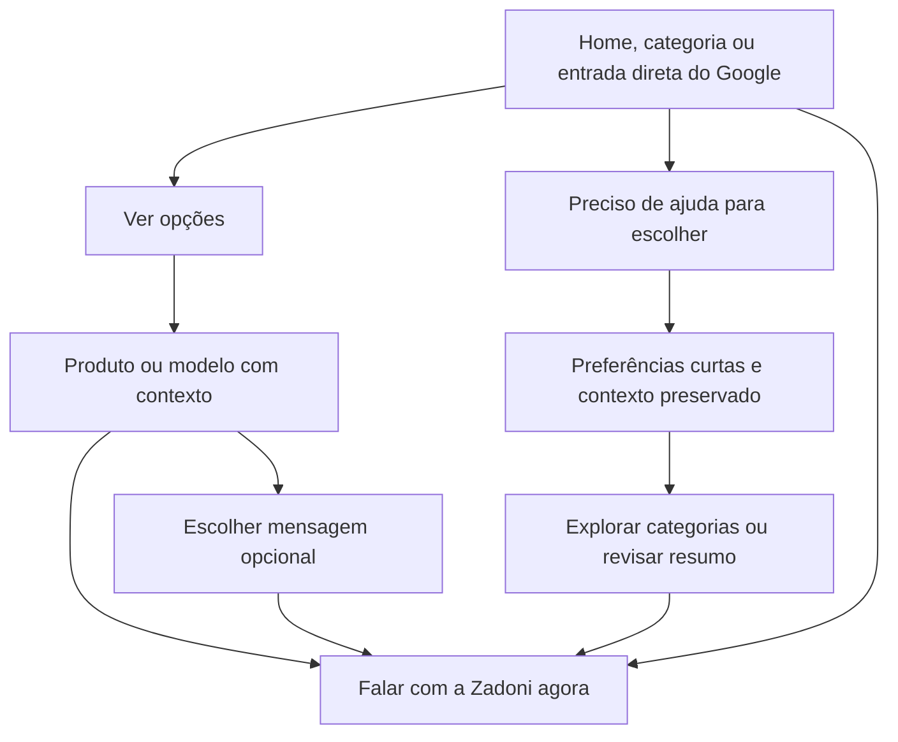

# Auditoria UX — escolher um presente e falar com a Zadoni

## Parecer

O site atende melhor quem já escolheu um produto do que quem precisa de orientação. A Home agora abre o cluster, mas a ajuda ainda não está distribuída pelas páginas de entrada. Os fluxos funcionam tecnicamente, porém há obstáculos de navegação, esforço desnecessário e uma sobrescrita de respostas no novo formulário.

Não considero atingido o objetivo de facilitar a escolha a partir de qualquer página. As prioridades abaixo tratam especificamente dessa jornada, sem presumir queda de conversão ou resultados de SEO que não foram medidos.

Esta foi uma **inspeção do projeto local**, sem alterar páginas, scripts ou estilos de produção. Não houve commit, push, deploy ou envio de mensagens. Entradas “do Google” foram simuladas abrindo cada URL diretamente, sem depender de navegação anterior; não foi verificado o índice do Google nem o estado atual da Hostinger.

## Cobertura e evidências

- 20 URLs do sitemap, mais `/links/` e `/404.html`: **22 entradas**, inspecionadas a 390 e 1440 px, altura de 844 px.
- Home, Guia, Mensagens, Natal e Monte sua cesta também a 320 px.
- As 22 páginas foram abertas com JavaScript desabilitado.
- Menus móveis existentes, mensagens de WhatsApp de produtos, busca sem resultados, transferência de ocasião, seleção de frases e fluxo de montagem de cesta.
- Reexecução da suíte do cluster: 15 verificações responsivas, dois fluxos completos de resumo, sete frases, teclado e fallback de falha de script.
- Inspeção visual das telas e leitura dos scripts de interação, além do grafo de links HTML.
- Google, Meta e WhatsApp bloqueados no navegador de teste. Nenhuma conversão real ou mensagem disparada.

Evidências reproduzíveis:

- [Páginas e posições dos controles](ui-customer-flows-audit-20260926/pages.json)
- [Grafo de navegação e caminhos mínimos](ui-customer-flows-audit-20260926/navigation-graph.json)
- [Cenários de uso](ui-customer-flows-audit-20260926/journeys.json)
- [Comportamento sem JavaScript](ui-customer-flows-audit-20260926/no-js.json)
- [Montagem de cesta, perfumaria e telas estreitas](ui-customer-flows-detail-20260926/details.json)
- [Suíte funcional do cluster](ui-customer-flows-functional-20260926/results.json)

Posições em pixels são observações do navegador local, não métricas de usuários reais. Podem variar com tela e carregamento. O caminho mínimo no grafo demonstra que um link existe, não que o cliente o encontrará intuitivamente. Links da página para seus próprios fragmentos não contam como uma nova entrada no guia.

## Problemas por prioridade

### P1 — 1. Quem entra em uma categoria não encontra a ajuda de escolha

**Confirmado:** catálogo, presentes locais, buquês, cestas, aniversário, floricultura, café da manhã, românticos, rosas, chocolates, perfumaria e Monte sua cesta não possuem link direto para `/guias-de-presentes/`. São 12 páginas locais. As quatro páginas de Achadinhos, Links e 404 também não apontam diretamente para o guia.

O menor caminho encontrado é página de entrada → Home → Guia. O cliente precisa deduzir que voltar ao início revelará uma ferramenta de ajuda. Os menus tradicionais continuam com as seis opções anteriores e não anunciam o guia.

**Correção proposta:** entrada consistente “Precisa de ajuda para escolher?” nas páginas locais, próxima às ações principais, com acesso ao guia e ao atendimento direto. Um link no rodapé é complementar; sozinho não resolve a descoberta em uma página longa. Nos Achadinhos, contextualizar “Está em Canaã? Peça ajuda à Zadoni”, mantendo explícita a finalidade nacional/afiliada dessas páginas.

**Aceite:** ao abrir qualquer categoria local diretamente em um celular, o cliente encontra “Ver opções”, “Me ajude a escolher” e “Falar com a Zadoni” sem retornar à Home. Adições nas páginas protegidas deverão ser delimitadas; não reescrever seus títulos, textos principais, schemas ou links atuais.

### P1 — 2. O formulário muda respostas do cliente ao escolher uma frase

**Reproduzido em Mensagens:** informar “Mãe” e clicar na frase para esposa muda o destinatário para “Esposa”. Informar “Natal” e escolher a frase para namorada muda a ocasião para “Surpresa romântica”.

O código em `assets/js/gift-guides.js`, no manipulador de `[data-use-message]`, atribui destinatário e ocasião independentemente de já haver uma escolha. O resumo permite conferir, mas a alteração não é anunciada claramente e pode passar despercebida.

**Correção proposta:** escolher uma frase altera somente a mensagem. Sugerir destinatário/ocasião apenas quando esses campos estiverem vazios, ou solicitar uma confirmação contextual para substituir respostas. Nunca sobrescrever silenciosamente.

**Aceite:** todos os campos previamente preenchidos, exceto a frase, permanecem intactos após selecionar qualquer cartão. O teste atual valida o preenchimento automático, mas não protege decisões anteriores do cliente.

### P1 — 3. A conversa direta ficou distante nas páginas feitas para ajudar

No Guia e em Mensagens não há WhatsApp na primeira tela nem atalho fixo. A primeira conversa direta aparece **depois** do formulário: aproximadamente y=5.158 px no Guia e y=4.918 px em Mensagens, na inspeção de 390 px. O link existe e funciona, mas sua posição exige percorrer uma interface de coleta de dados antes de descobrir que ela é opcional.

O Guia tem um atalho funcional “Encontrar meu presente” para o formulário; isso reduz a rolagem até o formulário, mas não substitui uma opção clara de atendimento imediato.

**Correção proposta:** incluir “Prefiro falar com a Zadoni” na abertura e antes das perguntas. Manter também o envio qualificado no resumo. Um atalho persistente pode ser avaliado sem encobrir conteúdo ou controles.

**Aceite:** o indeciso consegue abrir o WhatsApp sem escolher destinatário, estilo, orçamento ou mensagem. Quem prefere preencher continua tendo essa opção.

### P1 — 4. “Quero ajuda” em Monte sua cesta ainda exige orçamento

**Reproduzido:** em uma sessão limpa, a página renderizada tem zero links diretos de WhatsApp. O botão final aponta para `#modelos-title` e tem `aria-disabled="true"`. Clicar em “Quero ajuda para escolher” seleciona um modelo de ajuda, mas não libera o WhatsApp. Só após escolher uma faixa o link passa a abrir o atendimento.

O primeiro nível testado envia “Básica — A partir de R$ 220”. Não se trata de preço inventado pela auditoria: é a referência atual do configurador. O cliente sem orçamento definido fica obrigado a assumir uma faixa para pedir orientação.

O HTML sem JavaScript possui um link de atendimento, mas a renderização do configurador o substitui. O fallback, portanto, não funciona como saída imediata na experiência normal.

**Correção proposta:** manter um link independente “Quero orientação antes de escolher” e/ou permitir “Ainda não defini meu orçamento”. Preservar o fluxo de modelos e faixas para quem quer personalizar.

**Aceite:** pedir ajuda antes de definir modelo/faixa abre uma mensagem honesta de consulta, sem atribuir valor ou versão ao cliente.

### P2 — 5. A versão de Mensagens não é realmente resumida

Guia e Mensagens mostram os mesmos seis seletores obrigatórios, campo de observações e campo condicional de texto próprio. Na inspeção, ambos os formulários tinham cerca de 943 px de altura antes de um resumo. A mudança é essencialmente a introdução; não há redução efetiva do esforço.

Depois de escolher uma frase, o usuário precisa responder perguntas de estilo, investimento e recebimento para gerar o resumo, mesmo que só queira confirmar um cartão. A mensagem selecionada é colocada em um seletor, sem um cartão de prévia separado nessa etapa.

**Correção proposta:** na página de mensagens, mostrar a frase escolhida em destaque e oferecer duas ações: enviar essa mensagem à Zadoni ou completar preferências. Manter as perguntas disponíveis sem transformar todas em pré-requisito para conversar. No Guia, agrupar as perguntas em etapas curtas ou deixar os detalhes opcionais.

**Aceite:** uma pessoa consegue partir de uma frase para uma consulta sem preencher todo o briefing, e pode complementar quando desejar.

### P2 — 6. O contexto se perde ao trocar de página

**Reproduzido:** Natal → Guia abre com a ocasião vazia. O link não transporta contexto. Recarregar a página de mensagens elimina as respostas no teste. O novo formulário não tem persistência de rascunho nem leitura de parâmetros para contexto, diferentemente do configurador de cesta, que salva estado local.

Também não há um caminho que combine automaticamente um produto de categoria com uma frase da página Mensagens. O cliente pode explorar as duas páginas, mas terá de repetir a escolha na conversa.

**Correção proposta:** transportar contexto não sensível, como categoria e ocasião, por parâmetros reconhecidos. Preservar o que o cliente já informou durante a sessão, com opção de limpar. Evitar dados pessoais, mensagem livre ou observações em URLs e eventos de analytics. Contexto sugerido nunca deve sobrescrever edição explícita do usuário.

**Aceite:** Natal → Guia sugere Natal; categoria → ajuda identifica a categoria; navegação entre escolha e cartão conserva o contexto relevante de forma transparente.

### P2 — 7. Busca sem resultados não oferece ajuda contextual

**Reproduzido no catálogo:** busca por `zzzz-inexistente` exibe “Nenhum produto encontrado. Limpe os filtros para ver todas as opções.” O estado vazio não tem link próprio de guia nem WhatsApp. O atalho global de WhatsApp continua disponível, portanto não é um bloqueio total.

**Correção proposta:** acrescentar “Me ajude a escolher” e “Consultar o que procuro” junto de “Limpar filtros”. O cliente que não encontrou seu termo pode precisar de orientação, não apenas repetir a busca.

**Aceite:** resultado vazio oferece recuperação e atendimento no próprio ponto de dúvida.

### P2 — 8. A ferramenta organiza um pedido, mas não recomenda um presente

O resumo válido gerado contém as respostas e um botão de WhatsApp; não apresenta sugestões de categoria ou produto. Isso corresponde à função de qualificação implementada, porém o nome “Encontre o Presente Certo” pode criar expectativa de uma recomendação ao concluir.

**Correção proposta:** explicar antes do formulário que a Zadoni vai recomendar pelo WhatsApp, ou acrescentar duas ou três categorias úteis com base nas respostas, sem inventar estoque, preço ou garantia de adequação. Separar “explorar opções” de “enviar meu resumo”.

**Aceite:** o resultado entregue corresponde à expectativa criada no botão e no título.

### P2 — 9. A ajuda existe na Home, mas ainda não aparece na abertura

O primeiro cartão do novo guia apareceu por volta de y=1.431 px na inspeção móvel; o bloco fica após as categorias. É uma boa entrada contextual, mas o indeciso da primeira tela só vê o caminho para o catálogo. O menu também não anuncia a ajuda.

**Correção proposta:** manter o bloco e acrescentar um atalho secundário na abertura ou navegação, com prioridade visual abaixo da compra direta. Não é necessário promover as três páginas simultaneamente no menu.

**Aceite:** logo ao chegar, o cliente reconhece os dois caminhos: “Já sei o que procuro” e “Preciso de ajuda”.

### P3 — 10. Preferências e continuidade precisam de pequenos ajustes

- Destinatários do formulário limitados a esposa, namorada, namorado/parceiro, mãe, amiga e outra pessoa. Pai, marido, amigo, colega e criança exigem usar “Outra pessoa” e explicar em observações.
- O formulário novo não tem campo próprio de data desejada; a data é sugerida apenas no placeholder das observações. No atendimento por encomenda, isso pode exigir uma pergunta adicional. O configurador de cesta já tem esse campo.
- Não há “Ainda não decidi” em recebimento, embora existam saídas de ajuda para estilo, orçamento e mensagem.
- Sem JavaScript, os menus tradicionais permanecem visualmente fechados; os links de WhatsApp e conteúdo local continuam disponíveis. O cluster novo tem navegação estática utilizável. Convém padronizar a recuperação sem script em uma revisão futura.
- Existem famílias diferentes de navegação: catálogo tradicional, cluster novo, perfumaria, configurador e Achadinhos. O cliente precisa reaprender onde estão início, ajuda e contato ao mudar de área.

## Matriz das entradas

| Entrada | Contato com a Zadoni | Acesso direto ao Guia | Avaliação da decisão |
| --- | --- | --- | --- |
| Home | WhatsApp visível na primeira tela | Sim, bloco após categorias e rodapé | Melhorou; falta atalho para indecisos na abertura |
| Catálogo e categorias locais tradicionais | CTA e atalho persistente; produtos levam contexto | Não | Bom para produto escolhido; ajuda exige retorno à Home |
| Perfumaria | Contato na abertura e por produto, com nome do perfume | Não | Orientação por perfil existe; falta conexão com o guia |
| Monte sua cesta | Condicionado a modelo/ajuda e faixa no fluxo normal | Não | O usuário mais indeciso encontra uma exigência antes de falar |
| Guia | Após formulário e no rodapé | É o próprio guia | Atalho ao formulário funciona; contato direto está distante |
| Mensagens | Após formulário e no rodapé | Sim | Frases úteis, mas seleção pode sobrescrever respostas e demanda briefing completo |
| Natal | CTA de consulta na abertura | Sim | Bom início comercial; ocasião se perde ao entrar no guia |
| Achadinhos e seus três guias | Sem WhatsApp direto nas páginas verificadas | Não | Fluxo nacional/afiliado intencional; falta ponte explícita para cliente local |
| Links oficiais | WhatsApp na primeira tela | Não | Falta entrada para guia e mensagens |
| 404 | WhatsApp na primeira tela | Não | Recuperação existe; pode incluir ajuda de escolha |

## O que funcionou e deve ser mantido

- Nenhum overflow horizontal, exceção JavaScript ou imagem de carregamento inicial quebrada detectados nas 44 combinações de entrada/tela. Também sem overflow nas cinco telas de 320 px verificadas.
- Os menus móveis tradicionais testados abrem e fecham com Escape.
- As páginas mantêm conteúdo principal sem JavaScript; nas páginas locais há CTA de WhatsApp. Achadinhos mantém seu conteúdo e links nacionais.
- CTAs de buquê, cesta, café da manhã, catálogo e perfume preservam identificação do produto/modelo na mensagem.
- O formulário usa texto seguro na prévia e codifica corretamente acentos, emojis e caracteres especiais; mudar respostas invalida o resumo anterior.
- O cliente revisa antes de abrir o WhatsApp. A mensagem não é enviada automaticamente.
- A Home possui agora entradas reais para o cluster. O problema restante é distribuí-las pelas demais jornadas.

Observação de método: a primeira coleta de produto de perfumaria usou seletores de catálogo tradicional e não encontrou seu cartão. A checagem específica com `.pf-card` confirmou o CTA correto. Isso não é um defeito da página. Da mesma forma, “guiaLinks” no JSON bruto pode conter fragmentos que apontam para a própria página; a matriz acima considera a rota e o contexto.

## Fluxo-alvo

## Ordem de correção sugerida

1. Corrigir a sobrescrita de respostas no seletor de mensagens.
2. Colocar saída imediata para atendimento no Guia, Mensagens e configurador de cesta.
3. Distribuir o acesso ao guia nas páginas locais de entrada e em Links.
4. Simplificar a versão de Mensagens e preservar ocasião/categoria na transição entre páginas.
5. Melhorar busca vazia, expectativa do resultado e atalho de ajuda na abertura da Home.
6. Refinar destinatários, data e consistência de navegação.

Para considerar a jornada concluída, repetir os testes com entradas diretas, cliente sem orçamento, mensagem escolhida após preenchimento, categoria → ajuda, Natal → guia, nenhum resultado, teclado e script indisponível. As páginas anteriormente protegidas exigem alterações aditivas delimitadas para não perder o trabalho SEO; esta auditoria não modificou nenhuma delas.

Os testes automatizados aprovados validam integridade técnica. Eles não demonstram, sozinhos, clareza de escolha ou conversão. Não foi atribuído ganho de tráfego ou vendas a nenhuma proposta.
